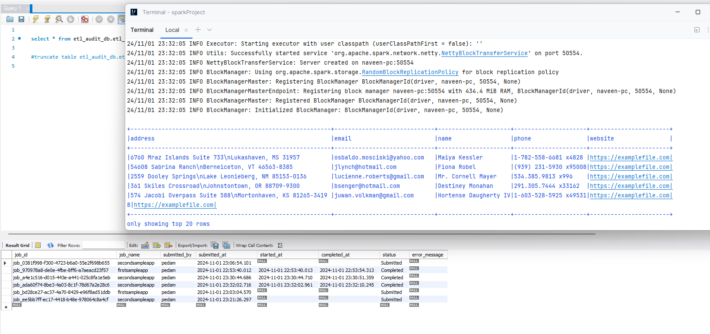

# This is simple spark scala project you can create with the below commands

**this project is created with the help of api written by Holdenkrau contribution to create scala projects using sbt**

-- create a specific location for in the system

-- sbt new holdenk/sparkProjectTemplate.g8

-- I have created reusable objects

**Description:**

--You will see only notebooks only.
--All the prerequisites and the related Theory is Commented where and ever its required.

**Install:Scala,sbt and required java version in laptop**

you will run from the command prompt:

sbt "runMain com.jobtrigger.TiggerAnyJob C:\\Users\\pedam\\PycharmProjects\\pythonProject\\configs.properties framework-variables SecondSampleApp"
sbt "runMain com.jobtrigger.TiggerAnyJob C:\\Users\\pedam\\PycharmProjects\\pythonProject\\configs.properties framework-variables FirstSampleApp"

You will see , the job executed and the audit , if you want you can modify audit framework as you want, 
i am including resources folder , will have MySQL scripts -- choose what ever you want.

